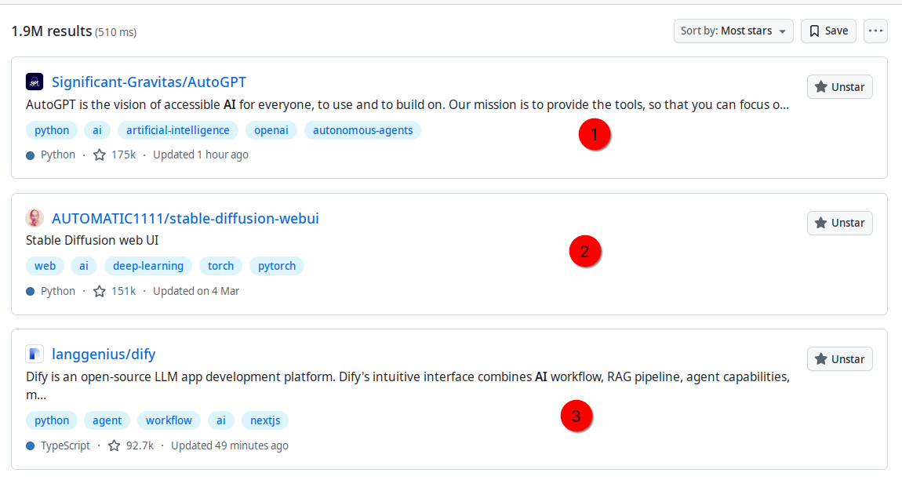
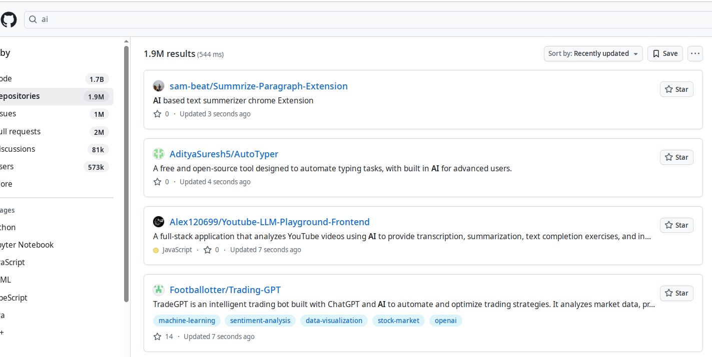
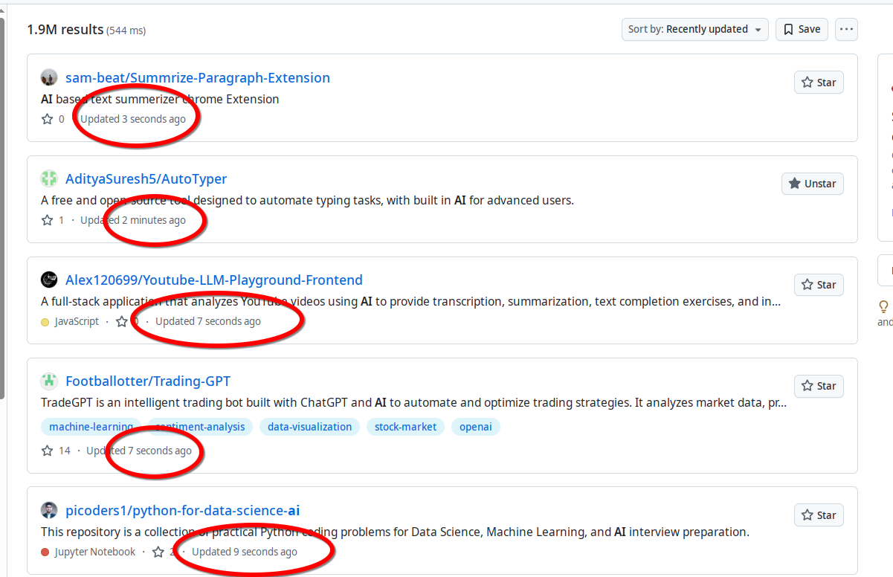
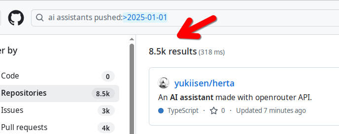

#  Github AI Searches

18 / 04 / 2025

This repository is simply a collection of links to Github searches intended to be a periodic jumping off point both for myself and anybody else who's wondered: *is it just me, or is there a vast - like VAST - amount of activity in AI, agents, and assistants in open source?*

If you ever wondered: *"is there an AI agent project for every human on the planet?"* the answer still seems to be no. But that there are so many of them that one wonders, sometimes, .... just how we got here.

But while this tidal wave of creative energy is daunting and hard to make sense of, it's also an interesting turf to wade through.

## Table of Contents
- [Github AI Searches](#github-ai-searches)
  - [Table of Contents](#table-of-contents)
- [AI - The Big Picture](#ai---the-big-picture)
- [AI - the firehose search](#ai---the-firehose-search)
- [AI Agents, Assistants, And MCP](#ai-agents-assistants-and-mcp)
  - [Other Searches](#other-searches)
- [All GitHub Searches](#all-github-searches)

So my motivation for trawling through Github repositories with parameters like `recently updated`: while there are some amazing AI projects with lots of traction, there's a constant trickle of interesting - and not so interesting - projects just getting started or trying out some first scripts.

This repo isn't even really a "repo" (sorry, Github). But if you want to get a sense for what's happening on the surface level of open source AI ... these might be helpful links.

# AI - The Big Picture

But before opening up the firehose, it's worth keeping a periodic check on the big picture. 

Here's a simple surrogate: the most unselective possible - ai filtered on 'Most Stars':

At the time of writing (very quickly to be outdated) this is what that will bring up. 

Even this small morsel of data is kind of interesting: who knew that [AutoGPT](https://github.com/Significant-Gravitas/AutoGPT) actually has almost as many stars as OpenWebUI and Dify **combined**! 

This search is worth keeping a periodic eye on. Everyone yardsticks will be different, but I would regard any project having amassed beyond 10K stars as showing significant traction. There's a lot to pick over before hitting that threshold.

# AI - the firehose search

Now we wheel out the firehose.

'ai' is unsophisticated but captures both anything to do with AI and repos that have `ai` in their slug. So it's actually surprisingly useful and arguably actually better than 'artificial intelligence' or "artificial intelligence" (exact match).

Filter on "recently updated" again and take a look at the flabbergasting volume:

Note the 1.9M repos number - which is big of course - but the frenetic pace of activity: there is literally an AI repository being created or updated on Github **virtually every second**!!

This isn't an exaggeration - notice the timestamps!

This is vast but is a fertile source material for some more nuanced analysis: so as firehoses come, it's a great one to start with. You'll see a steady stream of educational material; notes; projects; and ... everything in between.

# AI Agents, Assistants, And MCP

I find AI pretty fascinating but - to be even more unoriginal - my main interest at the moment is everything agentic. 

Beyond the hype and hyperbole ... what kind of practical use-cases are going to be realised by connecting AI tools to every conceivable digital system? 

Will MCP be a flash in the pan or does it represent the technical bedrock of the framework? All - at the time of writing - in a state of flux. 

Now for some semantics (kind of):

The distinction between AI "agents" and "assistants" at the moment is sort of shaky to put it mildly.

Most will reach for what seem like sensible distinctions: if it *does* something, like poll an API, it's an agent; if it doesn't, it's a (mere) assistant.

But peel back the layers of that and it gets a bit murky. 

If an assistant has read-only access against an API (or an MCP server)... is it "agentic"?

Personal assistants that send emails .... they're surely "agents" right? If so, why is this neck of the AI woods typically branded as AI "assistants" (answer: because humans who did this kind of thing were called that!?)

Should anyone ever read these musings, my "high level" opinion on agents and assistants is currently as follows: 

Agents and MCP and workflows are all very cool and powerful and impressive. But you can do a *vast* amount of good work in finding creative uses for LLMs simply by getting creative with system prompting. ChatGPT's recent advances in multi-turn memory retention have shown that you don't necessarily need a RAG pipeline to get highly useful personalisation: the personalisation can come from the other direction (the context you gradually accumulate through using a tool).

Finally, my keywords. 

Agents + recently updated to cover where most interest and branding will inevitably cluster: 

For assistants, here's my recommended starting point: it's a time-delimited search with the pushed date set to Jan 1st 2025. 

The objective here: to focus a bit more tightly on projects that are actively developing what they call assistants. 

"Assistants" will crowd in a little bit too much noise. So I tend to go a little bit tighter and use both 'ai' and 'assistants' as keywords with the same time-delimiter:

The volumes are still not insignificant but they're a lot easier to digest than the fearsome AI "firehose"!

## Other Searches

These are just some first notes and links. The vibrancy of the open source AI world is huge and there's more imaginative projects to dig through than sadly probably anybody has time.

# All GitHub Searches

Here's a comprehensive table of all the GitHub searches mentioned in this repository for quick reference:

| Search | Description | Link |
|--------|-------------|------|
| AI by Stars | Most starred AI repositories |  |
| AI Recently Updated | Most recently updated AI repositories |  |
| AI Agents/MCP/Assistants | Recently updated repositories related to AI agents, MCP, or assistants |  |
| Assistants Since 2025 | Assistant repositories updated since January 2025 |  |
| AI Assistants Since 2025 | AI Assistant repositories updated since January 2025 |  |